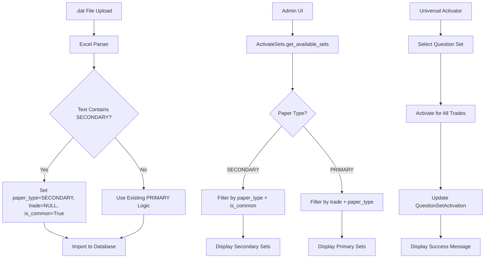
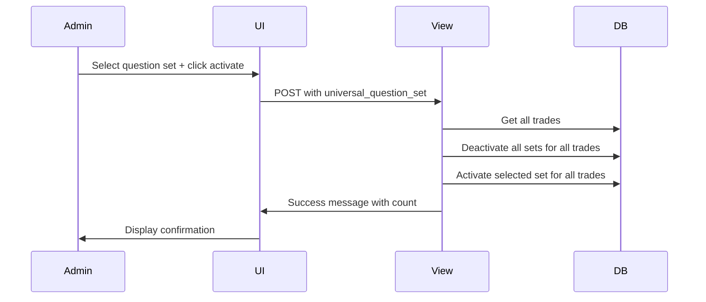

# Design Document

## Overview

This design addresses three critical issues in the question set management system: a data import bug that misclassifies SECONDARY questions, a UI filtering bug that prevents secondary questions from being displayed, and the lack of a universal set activation feature. The solution involves modifying the Excel parsing logic to detect SECONDARY questions by text content, fixing the filtering logic in the ActivateSets model, and adding a new universal activation interface to the admin template.

The core approach maintains backward compatibility while implementing targeted fixes for each issue. The data import fix uses text pattern matching to identify secondary questions, the UI fix implements conditional filtering based on paper type, and the universal activator adds bulk operations without disrupting existing individual trade management.

## Architecture

The solution involves modifications across three main components:



The architecture maintains the existing Django model relationships while adding intelligent classification logic and enhanced admin functionality.

## Components and Interfaces

### Modified Components

#### Excel Parser (questions/services.py)

**Current Interface:**
```python
def load_questions_from_excel_data(excel_bytes: bytes) -> List[Dict]:
    # Current logic uses paper_type column or trade-based inference
    paper_type = "SECONDARY" if trade_norm == "ALL" else "PRIMARY"
```

**New Interface:**
```python
def load_questions_from_excel_data(excel_bytes: bytes) -> List[Dict]:
    # Enhanced logic with text-based SECONDARY detection
    if paper_type_norm in ("PRIMARY", "P"):
        paper_type = "PRIMARY"
    elif paper_type_norm in ("SECONDARY", "S"):
        paper_type = "SECONDARY"
    elif "SECONDARY" in text.upper():
        paper_type = "SECONDARY"
        is_common = True
        trade_norm = ""  # Force NULL trade for secondary questions
    else:
        paper_type = "SECONDARY" if trade_norm == "ALL" else "PRIMARY"
```

#### ActivateSets Model (questions/models.py)

**Current Interface:**
```python
def get_available_sets(self, paper_type):
    # Buggy implementation applies trade filter to all paper types
    available_sets = Question.objects.filter(
        trade=self.trade,
        paper_type=paper_type,
        is_active=True
    ).values_list('question_set', flat=True).distinct().order_by('question_set')
    return list(available_sets)
```

**New Interface:**
```python
def get_available_sets(self, paper_type):
    """Get available question sets with paper-type-specific filtering"""
    if paper_type == 'SECONDARY':
        # Secondary questions: filter by paper_type and is_common only
        queryset = Question.objects.filter(
            paper_type='SECONDARY',
            is_common=True,
            is_active=True
        )
    else:
        # Primary questions: filter by trade and paper_type
        queryset = Question.objects.filter(
            trade=self.trade,
            paper_type=paper_type,
            is_active=True
        )
    
    available_sets = queryset.values_list('question_set', flat=True).distinct().order_by('question_set')
    return list(available_sets)

def get_question_count(self, paper_type, question_set):
    """Get question count with paper-type-specific filtering"""
    if paper_type == 'SECONDARY':
        return Question.objects.filter(
            paper_type='SECONDARY',
            is_common=True,
            question_set=question_set,
            is_active=True
        ).count()
    else:
        return Question.objects.filter(
            trade=self.trade,
            paper_type=paper_type,
            question_set=question_set,
            is_active=True
        ).count()
```

#### Admin Template (questions/templates/admin/questions/activatesets/change_list.html)

**New Universal Activator Section:**
```html
<!-- Universal Set Activation Section -->
<div class="module" style="margin-bottom: 30px;">
    <h2>Universal Question Set Activation</h2>
    <div style="padding: 25px;">
        <form method="post" style="display: flex; align-items: center; gap: 15px;">
            
            <label for="universal_question_set">Activate Set for All Trades:</label>
            <select name="universal_question_set" id="universal_question_set">
                <option value="">Select Question Set...</option>
                
                    <option value="{{ set }}">Set {{ set }}</option>
                
            </select>
            <button type="submit" name="action" value="activate_universal_set">
                Activate for All Trades
            </button>
        </form>
    </div>
</div>
```

#### Admin View (questions/admin.py)

**New Universal Activation Handler:**
```python
def changelist_view(self, request, extra_context=None):
    if request.method == 'POST' and request.POST.get('action') == 'activate_universal_set':
        return self._handle_universal_activation(request)
    
    # Existing logic...
    return super().changelist_view(request, extra_context)

def _handle_universal_activation(self, request):
    """Handle universal question set activation for all trades"""
    question_set = request.POST.get('universal_question_set')
    
    if not question_set or question_set not in ['A', 'B', 'C', 'D', 'E']:
        messages.error(request, "Please select a valid question set.")
        return redirect(request.path)
    
    # Get active paper type
    active_paper_type = self._get_active_paper_type()
    if not active_paper_type:
        messages.error(request, "Please activate a paper type first.")
        return redirect(request.path)
    
    # Activate for all trades
    updated_count = 0
    with transaction.atomic():
        for trade in Trade.objects.all():
            # Deactivate all sets for this trade and paper type
            QuestionSetActivation.objects.filter(
                trade=trade,
                paper_type=active_paper_type
            ).update(is_active=False)
            
            # Activate the selected set
            activation, created = QuestionSetActivation.objects.get_or_create(
                trade=trade,
                paper_type=active_paper_type,
                question_set=question_set,
                defaults={'is_active': True, 'activated_by': request.user}
            )
            if not created:
                activation.is_active = True
                activation.activated_by = request.user
                activation.save()
            
            updated_count += 1
    
    messages.success(
        request, 
        f"Successfully activated Set {question_set} for {updated_count} trades."
    )
    return redirect(request.path)
```

### Unchanged Components

#### Question Model Structure
- No changes to the Question model fields or relationships
- Existing database indexes support the new filtering patterns
- No database migrations required

#### QuestionSetActivation Model
- No changes to the activation tracking model
- Existing functionality for individual trade activation remains intact

#### Decryption and File Processing
- No changes to .dat file decryption logic
- Existing password-based decryption continues to work

## Data Models

### Question Model Data Patterns

**Primary Questions (Unchanged):**
- `trade`: Specific trade object (not NULL)
- `paper_type`: 'PRIMARY'
- `is_common`: False
- `question_set`: A-Z

**Secondary Questions (Enhanced Detection):**
- `trade`: NULL
- `paper_type`: 'SECONDARY'
- `is_common`: True
- `question_set`: A-Z
- **Detection Rule**: Text contains "SECONDARY" (case-insensitive)

### Classification Logic Matrix

| Condition | paper_type | trade | is_common | Detection Method |
|-----------|------------|-------|-----------|------------------|
| Text contains "SECONDARY" | SECONDARY | NULL | True | Text pattern matching |
| paper_type column = "SECONDARY" | SECONDARY | NULL | True | Column value |
| trade = "ALL" | SECONDARY | NULL | True | Trade inference |
| Default case | PRIMARY | Specific trade | False | Existing logic |

### Universal Activation Data Flow



## Correctness Properties

*A property is a characteristic or behavior that should hold true across all valid executions of a system-essentially, a formal statement about what the system should do. Properties serve as the bridge between human-readable specifications and machine-verifiable correctness guarantees.*

Now I need to use the prework tool to analyze the acceptance criteria before writing the correctness properties:

### Property 1: SECONDARY Question Classification
*For any* question with "SECONDARY" in its text field, when processed by the Excel parser, the question should have paper_type='SECONDARY', trade=NULL, and is_common=True, while preserving all other attributes
**Validates: Requirements 1.1, 1.2, 1.3, 1.5**

### Property 2: PRIMARY Question Classification Preservation
*For any* question without "SECONDARY" in its text field, when processed by the Excel parser, the existing PRIMARY classification logic should be applied unchanged
**Validates: Requirements 1.4, 5.1**

### Property 3: Paper-Type-Specific Filtering
*For any* call to get_available_sets(), if paper_type='SECONDARY' then filtering should use paper_type='SECONDARY' and is_common=True (no trade filter), if paper_type='PRIMARY' then filtering should use trade-specific and paper_type='PRIMARY' criteria
**Validates: Requirements 2.1, 2.2, 2.3, 2.5**

### Property 4: Question Count Accuracy and Consistency
*For any* question set and paper type, the result of get_question_count() should equal the actual count of questions matching the same filtering criteria used by get_available_sets(), and all counts should include only active questions
**Validates: Requirements 2.4, 6.1, 6.2, 6.3, 6.5**

### Property 5: Universal Set Activation Completeness
*For any* valid question set selection in universal activation, all trades should have that question set activated and all other question sets for those trades should be deactivated, with proper audit trail recording
**Validates: Requirements 3.2, 3.3, 3.4, 3.5**

### Property 6: Data Integrity During Operations
*For any* import or activation operation, existing Question records should remain unchanged, secondary questions should have consistent field values (trade=NULL, is_common=True, paper_type='SECONDARY'), and no database migrations should be required
**Validates: Requirements 4.1, 4.3, 5.4**

### Property 7: Duplicate Detection Consistency
*For any* question import operation, duplicate detection should use the same logic (text+part+trade/is_common+question_set) regardless of the new classification logic
**Validates: Requirements 4.2**

### Property 8: Comprehensive Error Handling
*For any* error condition (invalid files, decryption failures, malformed data, invalid parameters, database failures), the system should handle errors gracefully with appropriate logging, user feedback, and transaction rollback without crashing
**Validates: Requirements 4.4, 7.1, 7.2, 7.3, 7.4, 7.5**

### Property 9: Backward Compatibility Preservation
*For any* existing workflow (primary questions, admin interface, individual trade activation, .dat file processing), functionality should remain unchanged after implementing the fixes
**Validates: Requirements 5.1, 5.2, 5.3, 5.5**

### Property 10: Performance Optimization
*For any* large-scale operation (bulk imports, filtering, universal activation, count calculations), the system should use efficient database operations (bulk operations, indexes, batch updates) to maintain acceptable performance
**Validates: Requirements 8.1, 8.2, 8.3, 8.4, 8.5**

### Property 11: UI Display Consistency
*For any* question count display, zero counts should be shown as "0" rather than hidden, and the universal activation form should be present in the admin interface
**Validates: Requirements 3.1, 6.4**

### Property 12: System Integration Harmony
*For any* combination of universal and individual activation operations, they should work together without conflicts and maintain system stability
**Validates: Requirements 3.6**

## Error Handling

### Input Validation
- **Invalid Paper Type**: If an invalid paper_type is encountered, default to existing PRIMARY logic to maintain backward compatibility
- **Malformed Question Text**: Questions with empty or invalid text should be skipped during import with appropriate logging
- **Invalid Question Set**: If question_set is invalid, default to 'A' and log the issue
- **Missing Trade Information**: For PRIMARY questions, if trade cannot be resolved, skip the question and log the error

### File Processing Errors
- **Decryption Failures**: Log detailed error messages and continue processing other files
- **Excel Parsing Errors**: Skip malformed rows and continue processing valid data
- **File Format Issues**: Provide clear error messages for unsupported file formats
- **Large File Handling**: Implement memory-efficient processing for large datasets

### Database Error Handling
- **Transaction Failures**: Use atomic transactions with proper rollback on errors
- **Constraint Violations**: Handle duplicate key errors gracefully during bulk operations
- **Connection Issues**: Implement retry logic for transient database connection problems
- **Performance Degradation**: Monitor query performance and optimize as needed

### UI Error Handling
- **Invalid Form Submissions**: Validate all form inputs and provide clear error messages
- **Permission Errors**: Handle unauthorized access attempts gracefully
- **Session Timeouts**: Maintain user session state during long-running operations
- **Concurrent Access**: Handle multiple admin users performing operations simultaneously

## Testing Strategy

### Dual Testing Approach

This comprehensive fix requires both unit testing and property-based testing to ensure all three issues are resolved correctly:

**Unit Tests:**
- Test specific examples of SECONDARY text detection and classification
- Test edge cases like questions with partial "SECONDARY" matches
- Test individual trade activation vs universal activation workflows
- Test error conditions and recovery scenarios
- Test admin interface interactions and form submissions

**Property-Based Tests:**
- Verify universal properties across all possible question configurations
- Test classification logic with randomly generated question text containing various patterns
- Validate filtering consistency between get_available_sets() and get_question_count()
- Test universal activation with random trade and question set combinations
- Ensure backward compatibility across diverse existing data scenarios

**Property Test Configuration:**
- Use Django's TestCase with factory_boy for generating realistic test data
- Configure each property test to run minimum 100 iterations for thorough coverage
- Tag each test with format: **Feature: comprehensive-question-set-management-fix, Property {number}: {property_text}**
- Each correctness property must be implemented by a single property-based test

**Test Data Generation:**
- Generate questions with various text patterns including "SECONDARY", "secondary", "Secondary"
- Create realistic question distributions across different trades and question sets
- Include edge cases like empty question sets, inactive questions, and malformed data
- Generate admin user scenarios for testing universal activation workflows

**Integration Testing:**
- Test the complete .dat file upload and processing workflow
- Verify admin interface displays correct question sets after classification fixes
- Test universal activation updates all trades correctly
- Validate that existing primary question workflows remain functional
- Test concurrent operations and system stability under load

**Performance Testing:**
- Benchmark import performance with large .dat files (1000+ questions)
- Test filtering performance with realistic database sizes
- Validate universal activation performance with many trades
- Monitor memory usage during bulk operations

The testing strategy ensures that all three critical issues are resolved while maintaining system stability and performance.