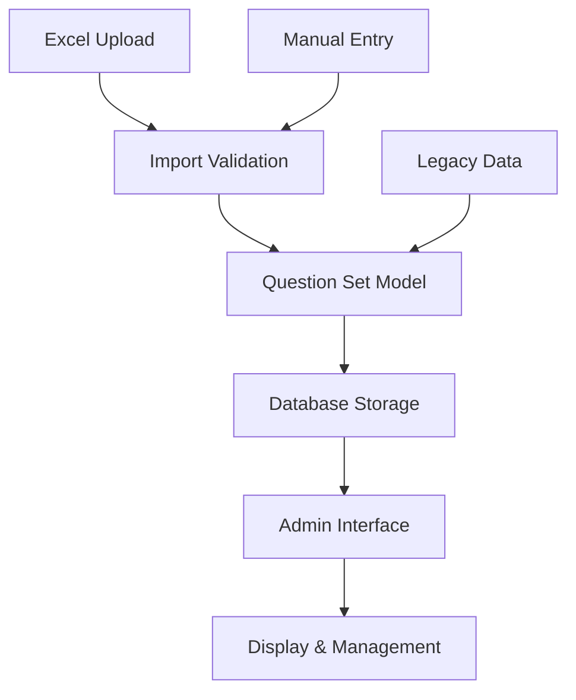

# Design Document: Customizable Question Set Naming

## Overview

This design transforms the exam portal's question set naming system from single-character restrictions (A, B, C, D, E, F) to fully customizable string identifiers. The solution involves updating Django model fields, modifying Excel import validation, enhancing the admin interface, and ensuring backward compatibility with existing data.

The implementation follows Django best practices for model field changes, uses robust validation patterns, and maintains data integrity throughout the migration process.

## Architecture

The system architecture involves three main layers:

1. **Data Layer**: Django models with updated CharField specifications
2. **Import Layer**: Excel processing with flexible validation rules  
3. **Presentation Layer**: Admin interface adaptations for variable-length names



## Components and Interfaces

### Question Set Model Updates

The core `QuestionSet` model requires field modifications:

```python
class QuestionSet(models.Model):
    # Updated from: question_set = models.CharField(max_length=1)
    question_set = models.CharField(
        max_length=100,
        unique=True,
        validators=[validate_question_set_name]
    )
    # Other existing fields remain unchanged
```

**Key Changes:**
- Increase `max_length` from 1 to 100 characters
- Add custom validator for business rules
- Maintain uniqueness constraint
- Preserve existing field relationships

### Excel Import Service

Enhanced import validation replaces single-character checks:

```python
class QuestionSetImportValidator:
    def validate_question_set_name(self, name: str) -> ValidationResult:
        # Replace single-letter validation with flexible rules
        # Handle whitespace trimming
        # Check length constraints
        # Validate character restrictions
```

**Import Flow:**
1. Read Excel file using pandas/openpyxl
2. Extract question_set column values
3. Apply new validation rules
4. Preserve exact naming from file
5. Report validation errors with context

### Admin Interface Enhancements

The Django admin interface requires updates for variable-length display:

```python
class QuestionSetAdmin(admin.ModelAdmin):
    list_display = ['question_set_display', 'question_count', 'created_date']
    list_filter = ['created_date']
    search_fields = ['question_set']
    
    def question_set_display(self, obj):
        # Handle long names with appropriate truncation/wrapping
```

## Data Models

### Updated Question Set Schema

```python
class QuestionSet(models.Model):
    question_set = models.CharField(
        max_length=100,
        unique=True,
        help_text="Descriptive name for this question set (e.g., 'Day 1', 'Morning Session')",
        validators=[validate_question_set_name]
    )
    created_date = models.DateTimeField(auto_now_add=True)
    updated_date = models.DateTimeField(auto_now=True)
    
    class Meta:
        ordering = ['question_set']
        verbose_name = "Question Set"
        verbose_name_plural = "Question Sets"
```

### Validation Rules

Custom validator implementation:

```python
def validate_question_set_name(value):
    """Validate question set names according to business rules."""
    if not value or not value.strip():
        raise ValidationError("Question set name cannot be empty")
    
    if len(value.strip()) > 100:
        raise ValidationError("Question set name cannot exceed 100 characters")
    
    # Allow letters, numbers, spaces, and common punctuation
    allowed_pattern = r'^[a-zA-Z0-9\s\-_.,()]+$'
    if not re.match(allowed_pattern, value.strip()):
        raise ValidationError("Question set name contains invalid characters")
```

### Database Migration Strategy

The migration preserves existing data while updating schema:

```python
class Migration(migrations.Migration):
    operations = [
        migrations.AlterField(
            model_name='questionset',
            name='question_set',
            field=models.CharField(
                max_length=100,
                unique=True,
                validators=[validate_question_set_name]
            ),
        ),
    ]
```

## Error Handling

### Import Error Management

Excel import errors provide specific feedback:

```python
class ImportError:
    INVALID_NAME = "Question set name contains invalid characters"
    DUPLICATE_NAME = "Question set name already exists"
    EMPTY_NAME = "Question set name cannot be empty"
    TOO_LONG = "Question set name exceeds 100 character limit"
```

### Validation Error Responses

The system returns structured error messages:

```python
{
    "success": False,
    "errors": [
        {
            "row": 5,
            "field": "question_set",
            "value": "Invalid@Name#",
            "message": "Question set name contains invalid characters"
        }
    ]
}
```

## Testing Strategy

### Unit Testing Approach

**Core Model Tests:**
- Test CharField validation with various input lengths
- Verify uniqueness constraints work correctly
- Test custom validator with edge cases
- Validate migration preserves existing data

**Excel Import Tests:**
- Test import with valid custom names
- Test import with invalid characters
- Test import with duplicate names
- Test import with empty/whitespace names
- Test backward compatibility with single letters

### Property-Based Testing Configuration

Property-based tests will use Django's test framework with [Hypothesis](https://hypothesis.readthedocs.io/) library for comprehensive input generation. Each test will run a minimum of 100 iterations to ensure robust validation across diverse inputs.

**Test Configuration:**
- Library: Hypothesis for Django
- Iterations: 100 minimum per property test
- Tag format: **Feature: customizable-question-set-naming, Property {number}: {property_text}**

## Correctness Properties

*A property is a characteristic or behavior that should hold true across all valid executions of a system—essentially, a formal statement about what the system should do. Properties serve as the bridge between human-readable specifications and machine-verifiable correctness guarantees.*

### Property 1: String Input Acceptance
*For any* string containing only letters, numbers, spaces, hyphens, underscores, periods, commas, and parentheses, the Portal_System should accept it as a valid question_set identifier when it's between 1 and 100 characters after trimming whitespace
**Validates: Requirements 1.1, 1.2, 1.3**

### Property 2: Excel Import Round Trip
*For any* valid question set name written in an Excel file, importing then reading the question_set value should return exactly the same string after whitespace trimming
**Validates: Requirements 2.1, 2.2**

### Property 3: Import Validation Consistency  
*For any* question set name, the validation rules applied during Excel import should produce the same result as validation during manual entry
**Validates: Requirements 2.3, 4.4**

### Property 4: Invalid Character Rejection
*For any* string containing characters outside the allowed set (letters, numbers, spaces, and common punctuation), the Portal_System should reject it and return a descriptive error message
**Validates: Requirements 2.4**

### Property 5: Legacy Compatibility
*For any* single-letter question set name (A, B, C, D, E, F), all system operations (create, read, update, delete, display, query) should work identically to how they worked before the update
**Validates: Requirements 3.1, 3.2, 3.3, 3.4**

### Property 6: Empty Input Rejection
*For any* string that is empty or contains only whitespace characters, the Portal_System should reject it as an invalid question_set name
**Validates: Requirements 4.1**

### Property 7: Whitespace Normalization
*For any* string with leading or trailing whitespace, the Portal_System should store and display only the trimmed version without the leading/trailing whitespace
**Validates: Requirements 4.2**

### Property 8: Uniqueness Enforcement
*For any* question set name that already exists in the system, attempting to create another question set with the same name should be rejected with an appropriate error message
**Validates: Requirements 4.3**

### Property 9: Migration Data Preservation
*For any* existing question set assignment before migration, the same assignment relationship should exist after the database migration is complete
**Validates: Requirements 5.3**

### Property 10: Display Completeness
*For any* valid question set name, the Admin_Interface display functions should return the complete name without truncation or modification
**Validates: Requirements 1.4, 6.1**

### Property 11: Partial Search Matching
*For any* substring of a question set name, searching with that substring should return the question set containing that substring in its name
**Validates: Requirements 6.4**