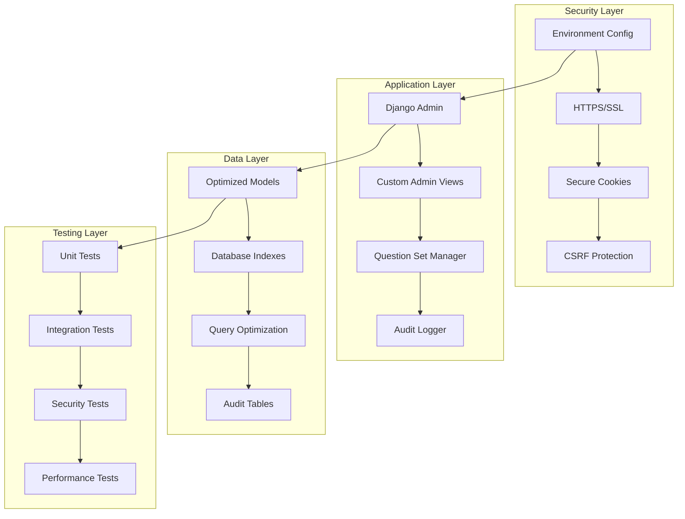

# Design Document: Django Exam Portal Security and Performance Improvements

## Overview

This design addresses critical security vulnerabilities and performance bottlenecks in the Django exam portal system while adding essential functionality for question set management and audit compliance. The solution implements production-ready security hardening, database optimization, comprehensive testing framework, and enhanced admin interfaces while maintaining backward compatibility.

The design follows Django best practices and security guidelines, implementing environment-based configuration, database indexing strategies, query optimization, audit logging, and robust question set assignment mechanisms.

## Architecture

### High-Level Architecture



### Security Architecture

The security architecture implements defense-in-depth principles:

1. **Configuration Security**: Environment variables for all sensitive data
2. **Transport Security**: HTTPS enforcement with secure headers
3. **Session Security**: Secure cookie configuration and CSRF protection
4. **Access Control**: Enhanced role-based permissions
5. **Audit Security**: Comprehensive logging with tamper protection

### Performance Architecture

The performance architecture focuses on database optimization:

1. **Index Strategy**: Strategic database indexes for common queries
2. **Query Optimization**: select_related and prefetch_related usage
3. **Admin Optimization**: Efficient admin interfaces with pagination
4. **Caching Strategy**: Strategic caching for frequently accessed data

## Components and Interfaces

### 1. Security Configuration Component

**Purpose**: Centralized security configuration management

**Key Classes**:
- `SecurityConfig`: Environment variable management
- `SecureSettingsValidator`: Configuration validation
- `EnvironmentLoader`: Safe environment variable loading

**Interfaces**:
```python
class SecurityConfig:
    def load_secret_key() -> str
    def get_allowed_hosts() -> List[str]
    def is_debug_enabled() -> bool
    def get_database_config() -> Dict[str, str]
    def validate_security_settings() -> bool
```

### 2. Database Optimization Component

**Purpose**: Database performance enhancement through indexing and query optimization

**Key Classes**:
- `IndexManager`: Database index management
- `QueryOptimizer`: Query optimization utilities
- `PerformanceMonitor`: Query performance tracking

**Database Indexes**:
```python
# Strategic indexes for common queries
class Trade(models.Model):
    name = models.CharField(max_length=100, db_index=True)
    
class QuestionSet(models.Model):
    trade = models.ForeignKey(Trade, on_delete=models.CASCADE, db_index=True)
    set_label = models.CharField(max_length=1, db_index=True)
    
class CandidateProfile(models.Model):
    role = models.CharField(max_length=20, db_index=True)
    trade = models.ForeignKey(Trade, on_delete=models.CASCADE, db_index=True)
```

### 3. Enhanced Admin Component

**Purpose**: Optimized admin interfaces with improved performance

**Key Classes**:
- `OptimizedModelAdmin`: Base admin class with query optimization
- `QuestionSetAdmin`: Enhanced question set management
- `CandidateAdmin`: Optimized candidate management

**Admin Optimizations**:
```python
class OptimizedModelAdmin(admin.ModelAdmin):
    def get_queryset(self, request):
        return super().get_queryset(request).select_related().prefetch_related()
    
    list_per_page = 50  # Pagination for performance
    list_select_related = True
```

### 4. Question Set Management Component

**Purpose**: Flexible question set assignment with universal and per-trade options

**Key Classes**:
- `QuestionSetManager`: Core question set logic
- `UniversalSetActivator`: Universal set activation
- `DurationManager`: Exam duration management
- `SetAssignmentValidator`: Assignment validation

**Interfaces**:
```python
class QuestionSetManager:
    def activate_universal_set(self, set_label: str, paper_type: str) -> bool
    def activate_trade_specific_sets(self, assignments: Dict[str, str]) -> bool
    def get_candidate_question_set(self, candidate_id: int) -> str
    def validate_set_assignment(self, trade_id: int, set_label: str) -> bool
```

### 5. Audit Logging Component

**Purpose**: Comprehensive audit trail for compliance and security

**Key Classes**:
- `AuditLogger`: Central audit logging
- `SecurityEventLogger`: Security-specific events
- `AdminActionLogger`: Administrative action tracking

**Audit Models**:
```python
class AuditLog(models.Model):
    user = models.ForeignKey(User, on_delete=models.CASCADE)
    action = models.CharField(max_length=100)
    model_name = models.CharField(max_length=100)
    object_id = models.CharField(max_length=100)
    changes = models.JSONField()
    timestamp = models.DateTimeField(auto_now_add=True)
    ip_address = models.GenericIPAddressField()
```

### 6. Testing Framework Component

**Purpose**: Comprehensive test coverage for security and functionality

**Key Classes**:
- `SecurityTestCase`: Security-focused test base
- `PerformanceTestCase`: Performance test utilities
- `AdminTestCase`: Admin interface testing

## Data Models

### Enhanced Models with Optimization

```python
class Trade(models.Model):
    name = models.CharField(max_length=100, db_index=True)
    code = models.CharField(max_length=10, unique=True, db_index=True)
    is_active = models.BooleanField(default=True, db_index=True)
    
    class Meta:
        indexes = [
            models.Index(fields=['name', 'is_active']),
            models.Index(fields=['code', 'is_active']),
        ]

class QuestionSet(models.Model):
    trade = models.ForeignKey(Trade, on_delete=models.CASCADE, db_index=True)
    set_label = models.CharField(max_length=1, db_index=True)
    paper_type = models.CharField(max_length=20, db_index=True)
    is_active = models.BooleanField(default=False, db_index=True)
    duration_minutes = models.IntegerField(null=True, blank=True)
    
    class Meta:
        unique_together = ['trade', 'set_label', 'paper_type']
        indexes = [
            models.Index(fields=['trade', 'set_label', 'paper_type']),
            models.Index(fields=['is_active', 'paper_type']),
        ]

class UniversalSetActivation(models.Model):
    set_label = models.CharField(max_length=1, db_index=True)
    paper_type = models.CharField(max_length=20, db_index=True)
    is_active = models.BooleanField(default=False)
    duration_minutes = models.IntegerField(null=True, blank=True)
    activated_by = models.ForeignKey(User, on_delete=models.CASCADE)
    activated_at = models.DateTimeField(auto_now_add=True)
    
    class Meta:
        unique_together = ['paper_type']
```

### Audit Models

```python
class AuditLog(models.Model):
    user = models.ForeignKey(User, on_delete=models.CASCADE, db_index=True)
    action = models.CharField(max_length=100, db_index=True)
    model_name = models.CharField(max_length=100, db_index=True)
    object_id = models.CharField(max_length=100)
    changes = models.JSONField()
    timestamp = models.DateTimeField(auto_now_add=True, db_index=True)
    ip_address = models.GenericIPAddressField()
    user_agent = models.TextField()
    
    class Meta:
        indexes = [
            models.Index(fields=['user', 'timestamp']),
            models.Index(fields=['action', 'timestamp']),
            models.Index(fields=['model_name', 'timestamp']),
        ]

class SecurityEvent(models.Model):
    event_type = models.CharField(max_length=50, db_index=True)
    user = models.ForeignKey(User, on_delete=models.CASCADE, null=True, db_index=True)
    ip_address = models.GenericIPAddressField(db_index=True)
    details = models.JSONField()
    timestamp = models.DateTimeField(auto_now_add=True, db_index=True)
    severity = models.CharField(max_length=20, db_index=True)
    
    class Meta:
        indexes = [
            models.Index(fields=['event_type', 'timestamp']),
            models.Index(fields=['severity', 'timestamp']),
        ]
```

Now I need to use the prework tool to analyze the acceptance criteria before writing the Correctness Properties section.

<function_calls>
<invoke name="prework">
<parameter name="featureName">exam-portal-security-performance-improvements

## Correctness Properties

*A property is a characteristic or behavior that should hold true across all valid executions of a system—essentially, a formal statement about what the system should do. Properties serve as the bridge between human-readable specifications and machine-verifiable correctness guarantees.*

Based on the prework analysis, I've identified several key properties that need consolidation to eliminate redundancy:

**Property Reflection:**
- Properties 1.1-1.6 (security configuration) can be consolidated into comprehensive security configuration properties
- Properties 2.1-2.5 (database optimization) can be combined into database performance properties  
- Properties 4.1-4.5 (admin performance) overlap with database optimization and can be consolidated
- Properties 5.1-5.5 (audit logging) can be streamlined into core audit properties
- Properties 8.1-8.5 (question set management) represent the core functionality and should remain separate

### Core Security Properties

**Property 1: Security Configuration Enforcement**
*For any* production deployment, all sensitive configuration (SECRET_KEY, database credentials, ALLOWED_HOSTS) should be loaded from environment variables and never from hardcoded values
**Validates: Requirements 1.1, 1.3, 1.4, 1.6**

**Property 2: Environment-Based Security Controls**
*For any* environment configuration, DEBUG mode should only be enabled in development environments and HTTPS should be enforced with secure cookies in production
**Validates: Requirements 1.2, 1.5**

### Database Performance Properties

**Property 3: Query Optimization Consistency**
*For any* database query involving trades, question sets, or candidate roles, the system should use appropriate indexes and query optimization techniques (select_related, prefetch_related) to prevent N+1 queries
**Validates: Requirements 2.1, 2.2, 2.3, 2.4, 2.5**

**Property 4: Admin Interface Performance**
*For any* admin interface displaying related data, the system should implement pagination, efficient queries, and prefetching to maintain responsive performance regardless of dataset size
**Validates: Requirements 4.1, 4.2, 4.3, 4.4, 4.5**

### Testing Coverage Properties

**Property 5: Comprehensive Test Coverage**
*For any* system module, the test suite should achieve minimum 80% code coverage and validate security, database operations, admin interfaces, and DAT file handling
**Validates: Requirements 3.1, 3.2, 3.3, 3.4, 3.5**

### Audit Logging Properties

**Property 6: Complete Audit Trail**
*For any* user action (authentication, data modification, file access, administrative operations), the system should create detailed audit log entries with user, timestamp, and change information
**Validates: Requirements 5.1, 5.2, 5.3, 5.4**

**Property 7: Audit Query Performance**
*For any* audit log query or search operation, the system should provide efficient filtering and search capabilities using indexed fields
**Validates: Requirements 5.5**

### Configuration Management Properties

**Property 8: Environment Configuration Flexibility**
*For any* deployment environment, the system should support environment-specific configuration without code changes and validate required variables at startup
**Validates: Requirements 6.1, 6.2, 6.4**

**Property 9: Secure Configuration Handling**
*For any* configuration operation involving sensitive data, the system should never expose credentials in logs or error messages and provide clear troubleshooting information
**Validates: Requirements 6.3, 6.5**

### Backward Compatibility Properties

**Property 10: Compatibility Preservation**
*For any* system improvement (security, performance, or feature enhancement), existing API interfaces, data relationships, user workflows, and functional behavior should remain unchanged
**Validates: Requirements 7.1, 7.2, 7.3, 7.4, 7.5**

### Question Set Management Properties

**Property 11: Flexible Set Activation**
*For any* question set configuration, the system should provide both universal activation (same set for all trades) and individual trade selection options
**Validates: Requirements 8.1**

**Property 12: Flexible Duration Management**
*For any* exam duration configuration, the system should provide both universal duration (same time for all trades) and individual trade duration options
**Validates: Requirements 8.2**

**Property 13: Question Set Assignment Persistence**
*For any* question set assignment to a trade, candidates should receive only questions from that specific set regardless of slot assignments, resets, or reassignments
**Validates: Requirements 8.3, 8.4, 8.5**

### DAT File Security Properties

**Property 14: DAT File Security Enforcement**
*For any* DAT file operation (upload, storage, access, processing), the system should validate integrity, maintain encryption, verify authorization, and use secure permissions
**Validates: Requirements 9.1, 9.2, 9.3, 9.4**

**Property 15: Secure DAT File Error Handling**
*For any* DAT file operation failure, the system should log security events without exposing sensitive data
**Validates: Requirements 9.5**

## Error Handling

### Security Error Handling

1. **Configuration Errors**: Clear error messages for missing environment variables without exposing system internals
2. **Authentication Failures**: Secure logging of failed attempts with rate limiting
3. **Authorization Errors**: Consistent error responses that don't reveal system structure
4. **File Access Errors**: Secure error handling for DAT file operations

### Performance Error Handling

1. **Database Errors**: Graceful handling of query timeouts and connection issues
2. **Admin Interface Errors**: User-friendly error messages for admin operations
3. **Large Dataset Handling**: Proper pagination and timeout handling for large queries

### Question Set Error Handling

1. **Assignment Conflicts**: Clear error messages for conflicting set assignments
2. **Duration Validation**: Validation errors for invalid duration configurations
3. **Set Availability**: Proper handling when assigned sets are unavailable

## Testing Strategy

### Dual Testing Approach

The testing strategy implements both unit testing and property-based testing as complementary approaches:

**Unit Tests**:
- Specific examples demonstrating correct behavior
- Edge cases and error conditions
- Integration points between components
- Security boundary testing

**Property-Based Tests**:
- Universal properties across all inputs
- Comprehensive input coverage through randomization
- Minimum 100 iterations per property test
- Each test tagged with design property reference

### Property-Based Testing Configuration

Using Django's built-in testing framework enhanced with Hypothesis for property-based testing:

```python
# Property test configuration
from hypothesis import given, strategies as st
from hypothesis.extra.django import from_model

class SecurityPropertyTests(TestCase):
    @given(st.text(min_size=1))
    def test_environment_variable_loading(self, config_value):
        """
        Feature: exam-portal-security-performance-improvements
        Property 1: Security Configuration Enforcement
        """
        # Test that environment variables are properly loaded
        
    @given(from_model(Trade))
    def test_query_optimization(self, trade):
        """
        Feature: exam-portal-security-performance-improvements  
        Property 3: Query Optimization Consistency
        """
        # Test that queries use proper optimization
```

### Test Coverage Requirements

- **Minimum 80% code coverage** across all modules
- **Security tests** for all authentication and authorization paths
- **Performance tests** for database queries and admin interfaces
- **Integration tests** for question set assignment workflows
- **Property tests** for all 15 identified correctness properties

### Testing Tools

- **Django TestCase**: Standard unit testing
- **Hypothesis**: Property-based testing library
- **Coverage.py**: Code coverage measurement
- **Django Debug Toolbar**: Query analysis in development
- **pytest-django**: Enhanced testing capabilities