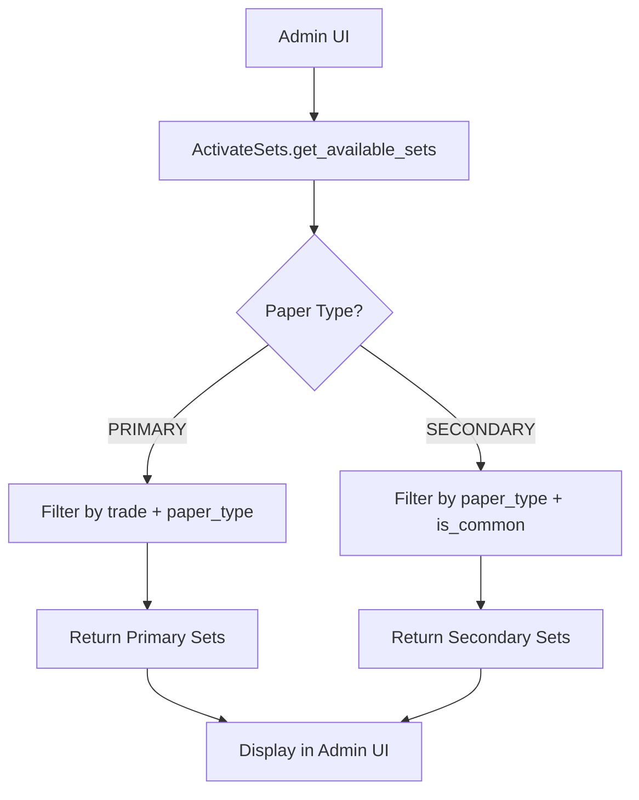

# Design Document

## Overview

This design addresses the critical bug in the question set management system where secondary questions are not displayed in the admin UI due to incorrect filtering logic. The solution involves modifying the `ActivateSets.get_available_sets()` and `get_question_count()` methods to apply different filtering strategies based on paper type.

The core issue is that secondary questions have `trade=NULL` and `is_common=True`, but the current implementation applies trade-based filtering to all paper types, resulting in empty results for secondary questions.

## Architecture

The fix involves a conditional filtering approach within the existing Django model architecture:



The architecture maintains the existing model relationships and admin interface while implementing paper-type-specific filtering logic.

## Components and Interfaces

### Modified Components

#### ActivateSets Model (questions/models.py)

**Current Interface:**
```python
def get_available_sets(self, paper_type):
    # Current buggy implementation
    available_sets = Question.objects.filter(
        trade=self.trade,
        paper_type=paper_type,
        is_active=True
    ).values_list('question_set', flat=True).distinct().order_by('question_set')
    return list(available_sets)

def get_question_count(self, paper_type, question_set):
    # Current buggy implementation
    return Question.objects.filter(
        trade=self.trade,
        paper_type=paper_type,
        question_set=question_set,
        is_active=True
    ).count()
```

**New Interface:**
```python
def get_available_sets(self, paper_type):
    """
    Get available question sets with paper-type-specific filtering
    """
    if paper_type == 'SECONDARY':
        # Secondary questions: filter by paper_type and is_common only
        queryset = Question.objects.filter(
            paper_type='SECONDARY',
            is_common=True,
            is_active=True
        )
    else:
        # Primary questions: filter by trade and paper_type
        queryset = Question.objects.filter(
            trade=self.trade,
            paper_type=paper_type,
            is_active=True
        )
    
    available_sets = queryset.values_list('question_set', flat=True).distinct().order_by('question_set')
    return list(available_sets)

def get_question_count(self, paper_type, question_set):
    """
    Get question count with paper-type-specific filtering
    """
    if paper_type == 'SECONDARY':
        # Secondary questions: filter by paper_type and is_common only
        return Question.objects.filter(
            paper_type='SECONDARY',
            is_common=True,
            question_set=question_set,
            is_active=True
        ).count()
    else:
        # Primary questions: filter by trade and paper_type
        return Question.objects.filter(
            trade=self.trade,
            paper_type=paper_type,
            question_set=question_set,
            is_active=True
        ).count()
```

### Unchanged Components

#### Question Model
- No changes required to the Question model structure
- Existing fields (trade, paper_type, is_common, is_active, question_set) remain unchanged
- Existing database indexes support the new filtering patterns

#### Admin Interface (questions/admin.py)
- No changes required to the admin interface code
- The existing admin logic will automatically benefit from the corrected filtering

#### Database Schema
- No database migrations required
- Existing data relationships remain intact

## Data Models

### Question Model Structure
```python
class Question(models.Model):
    # Core fields
    text = models.TextField()
    part = models.CharField(max_length=1, choices=Part.choices)
    marks = models.DecimalField(max_digits=5, decimal_places=2)
    
    # Classification fields
    trade = models.ForeignKey(Trade, null=True, blank=True)  # NULL for secondary
    paper_type = models.CharField(choices=PaperType.choices)  # PRIMARY/SECONDARY
    is_common = models.BooleanField(default=False)  # True for secondary
    question_set = models.CharField(max_length=1)  # A-Z
    
    # Status fields
    is_active = models.BooleanField(default=True)
    created_at = models.DateTimeField(auto_now_add=True)
```

### Data Patterns

**Primary Questions:**
- `trade`: Specific trade (not NULL)
- `paper_type`: 'PRIMARY'
- `is_common`: False
- `question_set`: A-Z

**Secondary Questions:**
- `trade`: NULL
- `paper_type`: 'SECONDARY'
- `is_common`: True
- `question_set`: A-Z

### Filtering Logic Matrix

| Paper Type | Trade Filter | is_common Filter | paper_type Filter |
|------------|--------------|------------------|-------------------|
| PRIMARY    | ✅ Required  | ❌ Not used      | ✅ Required       |
| SECONDARY  | ❌ Skip      | ✅ Required      | ✅ Required       |

## Correctness Properties

*A property is a characteristic or behavior that should hold true across all valid executions of a system-essentially, a formal statement about what the system should do. Properties serve as the bridge between human-readable specifications and machine-verifiable correctness guarantees.*

### Property 1: Secondary Question Filtering
*For any* ActivateSets instance, when get_available_sets() is called with paper_type='SECONDARY', all returned question sets should come from questions where paper_type='SECONDARY', is_common=True, and is_active=True, regardless of trade value
**Validates: Requirements 1.1, 1.2, 1.3, 5.1**

### Property 2: Primary Question Filtering  
*For any* ActivateSets instance and trade, when get_available_sets() is called with paper_type='PRIMARY', all returned question sets should come from questions where paper_type='PRIMARY', trade matches the instance's trade, and is_active=True
**Validates: Requirements 1.4, 2.1, 2.2, 5.2**

### Property 3: Question Count Accuracy
*For any* ActivateSets instance, paper type, and question set, the result of get_question_count() should equal the actual count of questions matching the same filtering criteria used by get_available_sets()
**Validates: Requirements 1.5, 4.1, 4.2**

### Property 4: Active Question Filtering
*For any* question filtering operation (get_available_sets or get_question_count), only questions with is_active=True should be included in results, regardless of paper type
**Validates: Requirements 2.3, 4.3, 5.4**

### Property 5: Method Consistency
*For any* ActivateSets instance and paper type, if get_available_sets() returns a question set, then get_question_count() for that same question set should return a positive integer
**Validates: Requirements 5.3**

## Error Handling

### Input Validation
- **Invalid Paper Type**: If an invalid paper_type is passed, the system should default to PRIMARY behavior to maintain backward compatibility
- **Missing Trade**: For PRIMARY paper types, if the ActivateSets instance has no associated trade, return empty results
- **Null Question Set**: If question_set parameter is null in get_question_count(), return 0

### Database Error Handling
- **Connection Errors**: Database connection issues should be handled by Django's standard error handling
- **Query Timeouts**: Large result sets should be handled efficiently using database indexes
- **Constraint Violations**: Any data integrity issues should be logged but not prevent the filtering operation

### Edge Cases
- **No Questions Found**: Return empty list for get_available_sets() and 0 for get_question_count()
- **Mixed Data States**: Handle cases where questions exist but no question sets are active
- **Orphaned Questions**: Questions with invalid paper_type values should be excluded from results

## Testing Strategy

### Dual Testing Approach

This fix requires both unit testing and property-based testing to ensure comprehensive coverage:

**Unit Tests:**
- Test specific examples of secondary vs primary question filtering
- Test edge cases like empty question sets and inactive questions
- Test error conditions and invalid inputs
- Test integration with existing admin interface workflows

**Property-Based Tests:**
- Verify universal properties across all possible question configurations
- Test filtering logic with randomly generated question data
- Validate consistency between get_available_sets() and get_question_count()
- Ensure active question filtering works across all scenarios

**Property Test Configuration:**
- Use Django's TestCase with factory_boy for generating test data
- Configure each property test to run minimum 100 iterations
- Tag each test with format: **Feature: secondary-question-display-fix, Property {number}: {property_text}**
- Each correctness property must be implemented by a single property-based test

**Test Data Generation:**
- Generate questions with various combinations of trade, paper_type, is_common, and is_active
- Create realistic question set distributions (A-E sets)
- Include edge cases like questions with null trades and mixed paper types
- Generate ActivateSets instances for different trades

**Integration Testing:**
- Test the admin interface displays correct question sets after the fix
- Verify that existing primary question workflows continue to function
- Test that question counts match displayed question sets
- Validate that the fix works across different trade configurations

The testing strategy ensures that the fix resolves the secondary question display issue while maintaining all existing functionality for primary questions.